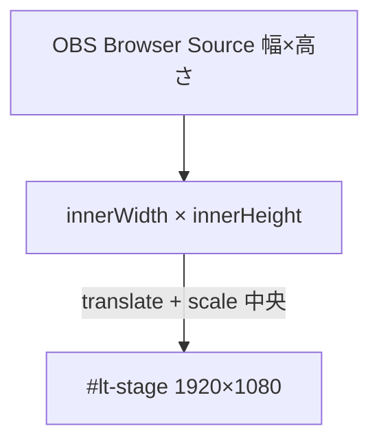
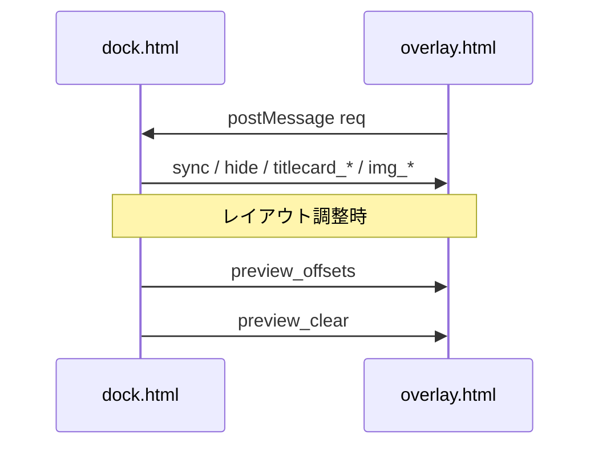

# Kasaneru — 構成・アーキテクチャ

## コンポーネント図

```mermaid
flowchart LR
  subgraph obs [OBS Studio]
    Dock[Custom Browser Dock\ndock.html]
    Browser[Browser Source\noverlay.html]
  end
  RC[Remote Controller\nStream Deck / Companion / Web]
  LS[(localStorage\nlt_ch_v5)]
  Dock <-->|BroadcastChannel\n"lt_chapter"| Browser
  RC <-->|optional WebSocket| Dock
  Dock <-->|read/write| LS
  Browser -->|req on load| Dock
```

（GitHub など Mermaid 非対応の環境では、Mermaid 図が表示されない場合があります。）

- **dock.html**: 操作 UI。チャプター / TitleCard / 画像 / グループ / 設定。状態は `lt_ch_v5` に JSON 保存。
- **overlay.html**: 透明背景。**論理レイアウト**は `#lt-stage` 内で **1920×1080px**。Browser Source の実サイズは `window` に合わせ **均等スケール（contain）＋中央**（`applyStageScale`）。詳細は [SPEC.md](./SPEC.md) / [BROADCAST-SETUP.md](./BROADCAST-SETUP.md)。
- **Custom CSS**: overlay が `<link id="custom-css">` で読み込むユーザースタイル。Settings → Extra CSS / User styles で指定。CDN 不使用。

## オーバーレイのビューポートスケール（overlay 側）



- 16:9 以外のビューポートではステージ周囲に **透明余白**（レターボックス）。
- カスタム CSS で `#lt-stage` の `transform` を上書きしないこと（上級者向け除く）。

## データフロー（同期）



## レイアウトガイド（自動モード）判定（dock 側）

`shouldShowLayoutGuides()` の要点:

1. **常に表示** → 常に true（配信中もプレビュー送信可）
2. **常に非表示** → 常に false（`preview_clear`）
3. **自動**  
   - **いずれかが配信中**（CH LIVE / TC 表示 / 画像表示）→ false  
   - **設定タブがアクティブ** → true  
   - **TC または画像のオフセット編集エリアが開いていて、かつ最小化されていない** → true  
   - それ以外 → false  

配信状態が変わったとき・編集パネルを閉じたとき・タブ切替時は `refreshLayoutGuidesVisibility()` が呼ばれ、`preview_clear` と未処理の `schedulePreview` デバウンスがキャンセルされる。

## localStorage スキーマ（概要）

キー `lt_ch_v5`。主要フィールド（代表）:

| 領域 | フィールド例 |
|------|----------------|
| チャプター | `chapters`, `selectedIdx`, `isLive`, `nextId` |
| グループ | `groups`, `nextGrpId` |
| TitleCard | `titleCardItems`, `titleCardSelectedIdx`, … |
| 画像 | `imgItems`, `imgSelectedIdx`, … |
| 設定 | `theme`, `accentColor`, `appearanceMode`, `layerOrder`, `layoutGuidesMode`, `labelFontSyncBadge`, … |
| Dock UI | `dockUi`, `uiLang`, `editLocked`, `dockChromeAccent` |

詳細は `dock.html` 内 `saveState()` を参照。

## 技術制約（L1）

- **ES5**（`var` / `function`、テンプレート・アロー禁止）
- **CDN 禁止**（OBS CEF でブロックされやすい）
- **backdrop-filter** 等、Browser Source で不安定な CSS は避ける
